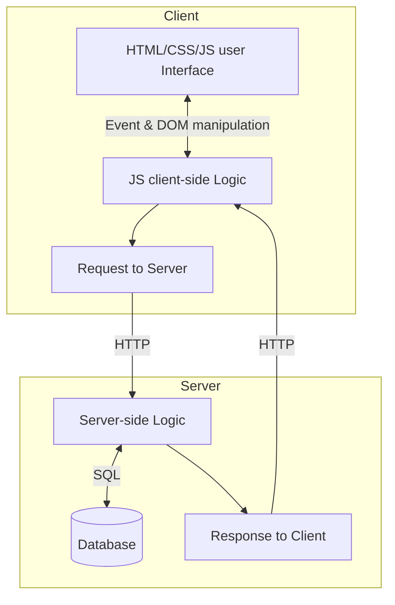
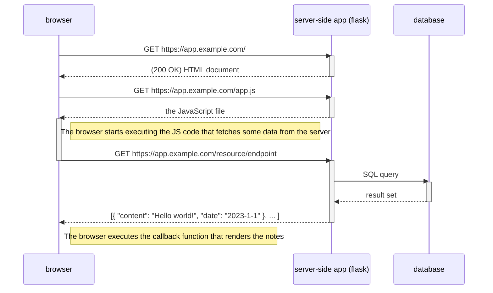

# Ohjelmisto 1 ja 2 esimerkit

## Kansiot

- moduulikohtaiset esimerkit omissa kansioisan
- `/extra`: python-moduuliesimerkit (koodin jakaminen eri tiedostoihin)

## Client-server-arkkitehtuuri

---

Sekvenssikaavio

